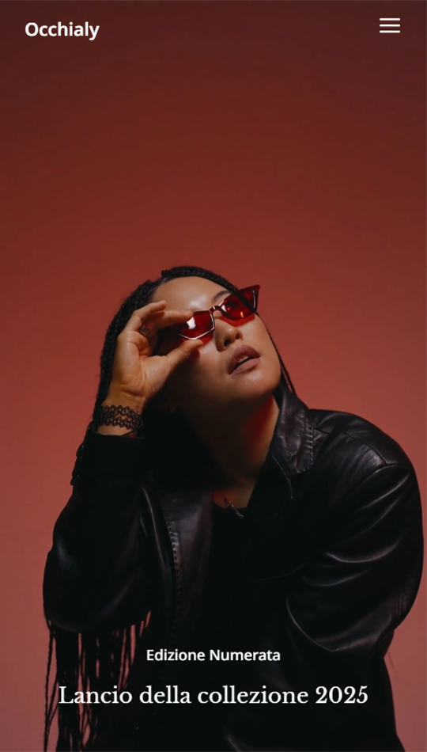

# Occhialy

**Occhialy** è un progetto costruito con React, che offre un design elegante e semplice. Realizzato interamente in React, il sito è pensato per offrire un'esperienza utente dinamica e responsive.

Questo progetto è stato creato come esercizio di sviluppo web e sarà utilizzato come portfolio per presentare le mie competenze nella creazione di siti dinamici con React. L'obiettivo è replicare l'aspetto di un sito esistente, mantenendo una struttura responsive e un'interfaccia utente moderna.

## Caratteristiche
- Sito sviluppato con React.
- Utilizzo di componenti React per una gestione dinamica della UI.
- Mobile-friendly, per un'esperienza utente ottimale su dispositivi mobili.
- Utilizzo di **Styled Components** per lo styling dei componenti React
- Navigazione tra pagine gestita con **React Router**

## 📸 Screenshot
### Desktop

### Mobile


## Installazione

Per eseguire il progetto localmente:

1. Clona il repository:

   ```bash
   git clone <URL_DEL_REPOSITORY>
   ```

2. Entra nella cartella del progetto:

   ```bash
   cd occhialy
   ```

3. Installa le dipendenze:

   ```bash
   npm install
   ```

4. Avvia il server di sviluppo:

   ```bash
   npm run dev
   ```

   Oppure, per una build di produzione:

   ```bash
   npm run build
   

## 📌 Credis
- I video di sfondo sono stati presi da [Pexels](https://www.pexels.com/).
- Le immagini sono state generate tramite intelligenza artificiale (es. DALL·E, Midjourney, Stable Diffusion).