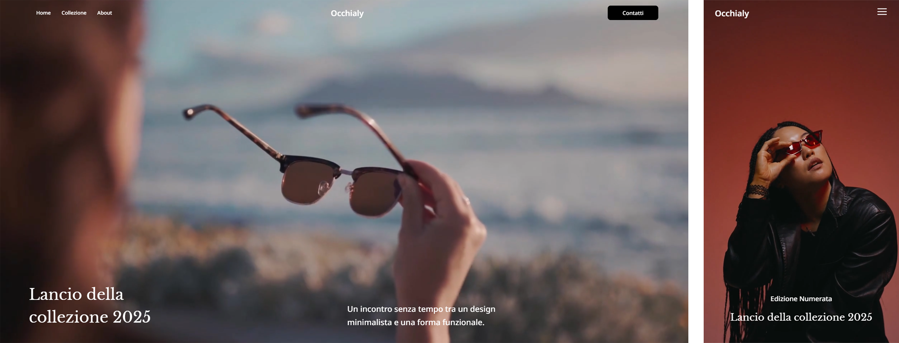

# Occhialy

### [📜Italiano](README_IT.md)

**Occhialy** is a project built with React, offering an elegant and simple design. Fully developed in React, the website is designed to provide a dynamic and responsive user experience.

This project was created as a web development exercise and will be used as a portfolio to showcase my skills in building dynamic websites with React. The goal is to replicate the look of an existing website while maintaining a responsive structure and a modern user interface.

## Features
- Website developed with React.
- Use of React components for dynamic UI management.
- Mobile-friendly, providing an optimal user experience on mobile devices.
- Use of **Styled Components** for styling React components.
- Page navigation managed with **React Router**.

## 📸 Screenshot
### Desktop / Mobile


## Installation

To run the project locally:

1. Clone the repository:

   ```bash
   git clone <REPOSITORY_URL>
   ```

2. Navigate into the project folder:

   ```bash
   cd occhialy
   ```

3. Install the dependencies:

   ```bash
   npm install
   ```

4. Start the development server:

   ```bash
   npm run dev
   ```

   Or, for a production build:

   ```bash
   npm run build
   ```

## 📌 Credits
- The background videos were sourced from [Pexels](https://www.pexels.com/).
- The images were generated through artificial intelligence (e.g., Leonardo AI, Microsoft Designer).